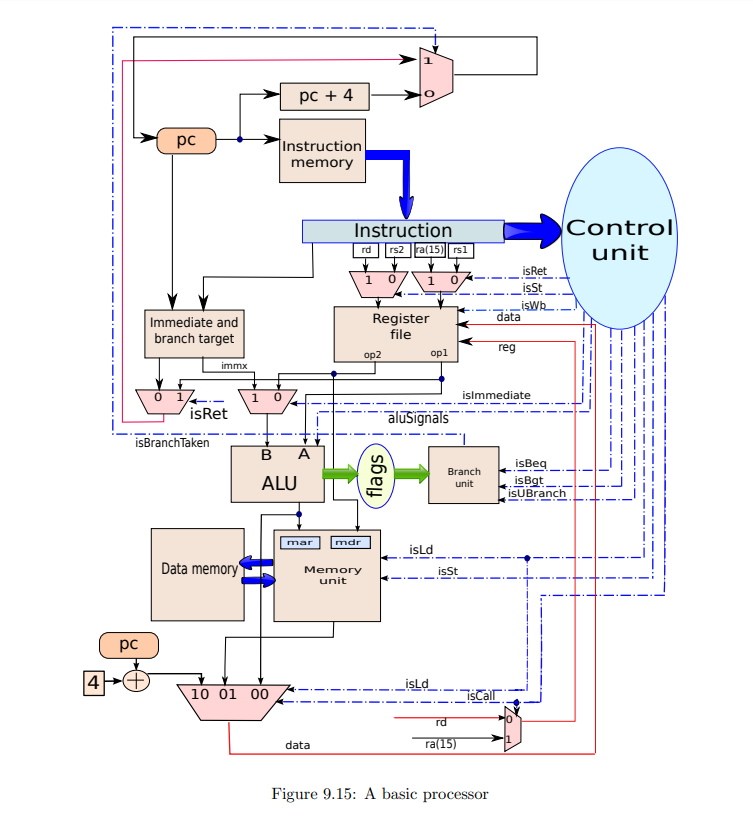

# Simple-RISC-Processor-Implementation
This repository contains an implementation of a Simple RISC Processor based on the design from the book **"Basic Computer Architecture"** by Dr. Smruti Ranjan Sarangi, IIT Delhi. The processor is designed in Verilog and includes the following five stages:
- Instruction Fetch (IF)
- Operand Fetch (OF)
- Execute (EX)
- Memory Access (MA)
- Write Back (WB)
- 
## Architecture

## Features
- 16 registers (14 general purpose, 2 special purpose) that are 32-bit wide.
- Single-cycle processor triggered on the negative clock edge.
- Supports 21 instructions including:
  - 13 arithmetic instructions (ADD, SUB, MUL, DIV, etc.)
  - Branch instructions
  - Load and store instructions
  - Call instructions

## Project Structure
- `ALU.v`: Contains the Arithmetic Logic Unit implementation.
- `ControlUnit.v`: Contains the control unit implementation.
- `ExecuteStage.v`: Contains the execution stage implementation.
- `Instruction_Fetch.v`: Contains the instruction fetch stage implementation.
- `Memory_Access.v`: Contains the memory access stage implementation.
- `Operand_Fetch.v`: Contains the operand fetch stage implementation.
- `Register_File.v`: Contains the register file implementation.
- `Register_Write_Back.v`: Contains the register write back stage implementation.
- `Simple_Risc_Processor.v`: Top-level module connecting all stages
- `test.v`: Test Bench for the Module

This design is based on the book:
**"Basic Computer Architecture"** by Dr. Smruti Ranjan Sarangi, IIT Delhi. [Link to the book](https://www.cse.iitd.ac.in/~srsarangi/archbooksoft.html)
